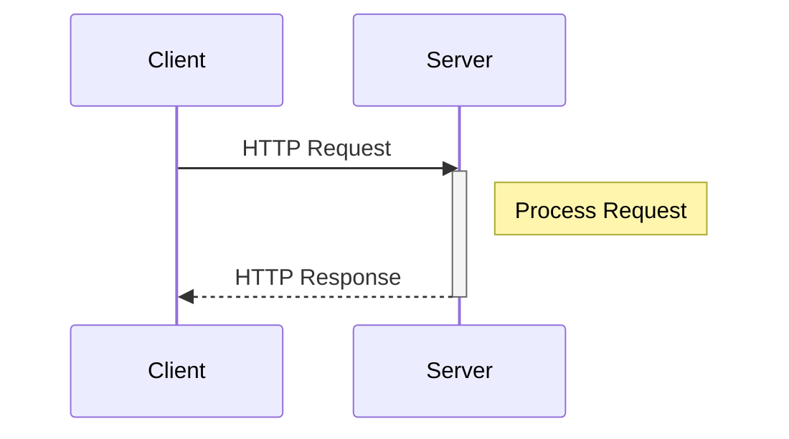

# 0. Basics of HTTP/HTTPS

HTTP (HyperText Transfer Protocol) is a communication protocol used for transferring data over the web. It enables communication between a client (such as a web browser) and a server by sending requests and receiving responses. HTTP defines how these exchanges should be structured to access resources (web pages, images, files, etc.) on the internet. It is a stateless protocol, meaning it does not retain any information about previous interactions.

## 1. Differences between HTTP and HTTPS

| **Characteristic**    | **HTTP**                                                       | **HTTPS**                                                     |
|-----------------------|---------------------------------------------------------------|---------------------------------------------------------------|
| **Security**          | Not encrypted, vulnerable to attacks (e.g., data interception) | Encrypted with SSL/TLS, secure against attacks (e.g., eavesdropping, MITM) |
| **Integrity**         | Risk of data modification by an attacker                      | Protection against data modification through encryption        |
| **Confidentiality**   | Data is visible in plain text over the network                 | Data is encrypted and unreadable to third parties              |
| **Authentication**    | No guarantee of server authenticity                           | Use of SSL/TLS certificates to prove the server's identity     |
| **Port used**         | Generally **80**                                              | Generally **443**                                              |
| **URL**               | Starts with `http://`                                          | Starts with `https://`                                         |
| **Usage**             | Suitable for sites without sensitive data (e.g., blogs)        | Recommended for sites handling sensitive information (e.g., banks, e-commerce) |

➡️ HTTPS is an enhanced and secure version of HTTP, ensuring **confidentiality, integrity, and authentication**. It is essential for protecting communications on the internet.

## 2. Structure of HTTP

### Structure of an HTTP request:
An HTTP request consists of four main elements:
- The **HTTP Method** determines the action (e.g., `GET`, `POST`).
- The **URL** identifies the requested resource.
- **Headers** provide additional information about the request.
- The **Body** is optional and contains the data sent (e.g., during a `POST`).

### Structure of an HTTP response:
An HTTP response also contains several elements:
- **Status code**: Indicates the result of the request (e.g., `200 OK`, `404 Not Found`, `500 Internal Server Error).
- **Headers**: Additional information about the response.
- **Body**: Contains the data returned by the server (e.g., the HTML content of a web page).

➡️ HTTP works on a client-server model, where the client sends a request, and the server responds with information structured as status, headers, and data.

## 3. Common HTTP Methods

| **GET**    | Retrieve data                  | Display a web page or fetch information from an API |
| **POST**   | Send data to the server        | Submit a registration form                         |
| **PUT**    | Update a resource              | Modify a user profile                               |
| **DELETE** | Delete a resource              | Delete a user account                               |

## 4. Common HTTP Status Codes

| **Code** | **Meaning**       | **Example**                                           |
|----------|-------------------|-------------------------------------------------------|
| **200**  | OK (success)      | A page loads correctly                               |
| **301**  | Permanent redirect | A site has changed its address                        |
| **403**  | Forbidden         | Attempt to access a page without permissions          |
| **404**  | Not found         | The requested URL does not exist                     |
| **500**  | Server error      | A server-side issue prevents display                 |

➡️ HTTP status codes are returned by the server to indicate the state of a request. They are classified into categories:

- **1xx**: Informational
- **2xx**: Success
- **3xx**: Redirections
- **4xx**: Client-side errors
- **5xx**: Server-side errors
