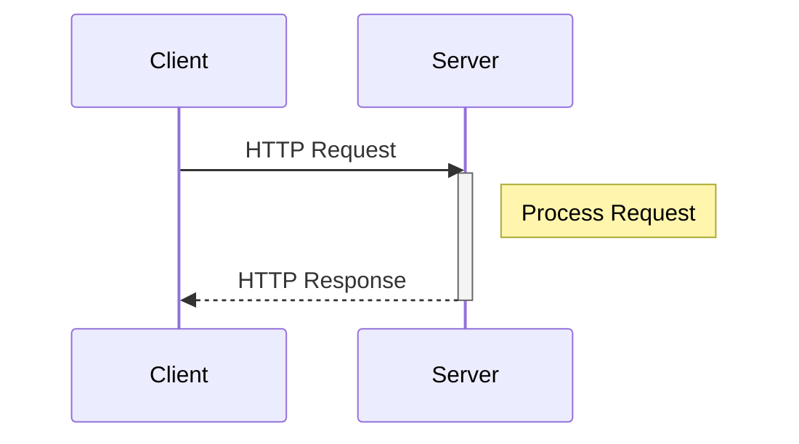

# 0. Basics of HTTP/HTTPS

## 1. Différences entre HTTP et HTTPS

| **Caractéristique** | **HTTP** | **HTTPS** |
|----------------------|---------|-----------|
| **Sécurité** | Non chiffré, vulnérable aux attaques (ex: interception de données) | Chiffré avec SSL/TLS, sécurisé contre les attaques (ex: écoute clandestine, MITM) |
| **Intégrité** | Risque de modification des données par un attaquant | Protection contre la modification des données grâce au chiffrement |
| **Confidentialité** | Les données sont visibles en clair sur le réseau | Les données sont chiffrées et illisibles pour les tiers |
| **Authentification** | Pas de garantie d'authenticité du serveur | Utilisation de certificats SSL/TLS pour prouver l’identité du serveur |
| **Port utilisé** | Généralement **80** | Généralement **443** |
| **URL** | Commence par `http://` | Commence par `https://` |
| **Utilisation** | Convient aux sites sans données sensibles (ex: blogs) | Recommandé pour les sites traitant des informations sensibles (ex: banques, e-commerce) |

➡️ **Conclusion** : HTTPS est une version améliorée et sécurisée de HTTP, assurant **confidentialité, intégrité et authentification**. Il est indispensable pour protéger les communications sur Internet.  

---

## 2. Structure de HTTP

📌 **Explication du diagramme :**  
- Une requête HTTP est composée de **quatre éléments principaux**.  
- La **Méthode HTTP** détermine l’action (ex: `GET`, `POST`).  
- L’**URL** identifie la ressource demandée.  
- Les **En-têtes (Headers)** fournissent des informations supplémentaires sur la requête.  
- Le **Corps (Body)** est **optionnel** et contient les données envoyées (ex: lors d’un `POST`).  

### **Structure d'une réponse HTTP :**
Une réponse HTTP contient également plusieurs éléments :  
- **Code de statut** : Indique le résultat de la requête (ex: `200 OK`, `404 Not Found`, `500 Internal Server Error`).  
- **En-têtes (Headers)** : Informations supplémentaires sur la réponse.  
- **Corps (Body)** : Contient les données renvoyées par le serveur (ex: le contenu HTML d’une page web).  

➡️ **Conclusion** : HTTP fonctionne sur un modèle **client-serveur**, où le client envoie une requête et le serveur répond avec des informations structurées sous forme de **statuts, en-têtes et données**.

---

## 3. Méthodes HTTP courantes

| **Méthode** | **Description** | **Cas d’utilisation** |
|------------|---------------|----------------------|
| **GET** | Récupérer des données | Afficher une page web ou récupérer des infos d’une API |
| **POST** | Envoyer des données au serveur | Envoyer un formulaire d’inscription |
| **PUT** | Mettre à jour une ressource | Modifier un profil utilisateur |
| **DELETE** | Supprimer une ressource | Supprimer un compte utilisateur |

➡️ **Remarque** : D'autres méthodes comme `PATCH`, `HEAD` ou `OPTIONS` existent, mais `GET`, `POST`, `PUT` et `DELETE` sont les plus courantes.

---

## 4. Codes de statut HTTP courants

| **Code** | **Signification** | **Exemple** |
|---------|----------------|----------|
| **200** | OK (succès) | Une page se charge correctement |
| **301** | Redirection permanente | Un site a changé d’adresse |
| **403** | Accès interdit | Tentative d’accès à une page sans permissions |
| **404** | Page non trouvée | L’URL demandée n’existe pas |
| **500** | Erreur serveur | Un problème côté serveur empêche l’affichage |

➡️ **Explication** : Les codes de statut HTTP sont renvoyés par le serveur pour indiquer l’état d’une requête. Ils sont classés par catégories :  
- **1xx** : Informations  
- **2xx** : Succès  
- **3xx** : Redirections  
- **4xx** : Erreurs côté client  
- **5xx** : Erreurs côté serveur  

---

